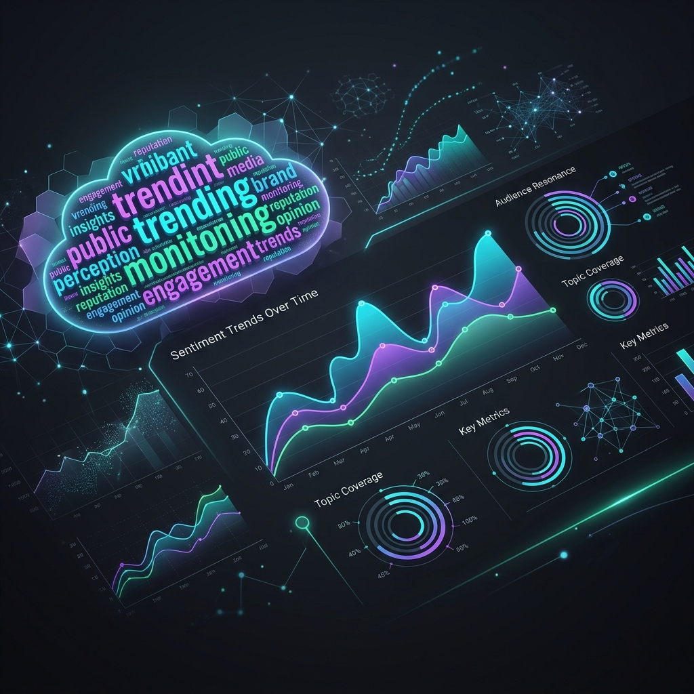
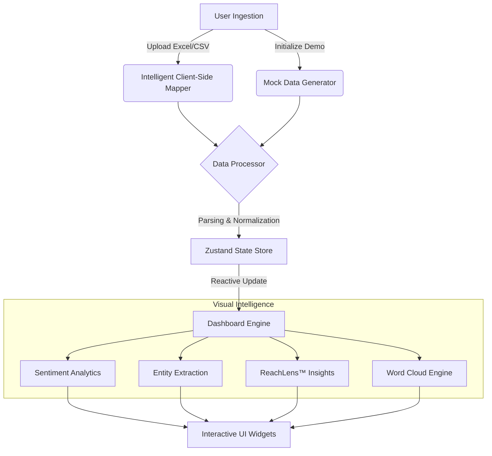
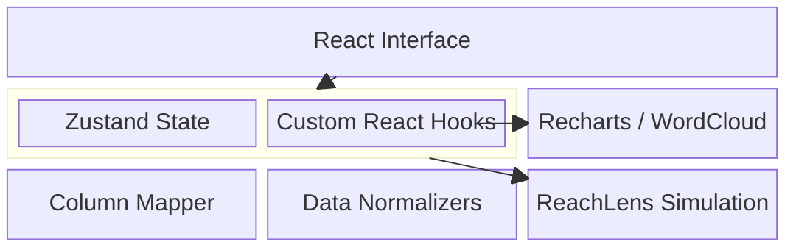

# 📈 Analysis Dashboard with ReachLens™ (Frontend Demo)



## 🌐 Live Experience
**[Explore the Live Interactive Dashboard](https://frontend-swart-alpha-94.vercel.app)**

> **A premium, state-of-the-art intelligence platform** designed for real-time PR and sentiment analysis. This frontend-only deployment showcases a sleek, high-performance UI built for deep data exploration and decision-making.

---

## 🔄 Application Flow & Architecture

### 🛠️ Frontend Logic Flow


### 🧱 System Block Architecture


---

## ✨ Premium Features

### 📊 Advanced Sentiment Intelligence
*   **Gradient-Infused Analytics:** Custom-styled visualizations using HSL-tailored color palettes for positive, neutral, and negative sentiment.
*   **Interactive Drill-downs:** Click-to-expand details for every data point, providing deep context behind the numbers.

### ⚔️ Competitor Head-to-Head
*   **Dynamic Comparison Engine:** Side-by-side analysis mode with deterministic data shifting, allowing for comparative market positioning.
*   **Visual Benchmarking:** Real-time rendering of performance metrics across multiple entities.

### ☁️ Intelligence Word Cloud
*   **Semantic Clustering:** Dense, block-style word clouds that intelligently group "hot topics" using an orthogonal orientation system.
*   **Custom Theming:** Vibrant, high-contrast colors designed for maximum readability and visual impact.

### 🔍 ReachLens™ Integration
*   **Proprietary Metric Simulation:** Visualize audience reach across social media and digital publications through a refined, glassmorphism-inspired UI.

---

## 🛠️ Technology Stack

| Layer | Technologies |
|-------|--------------|
| **Core Framework** | **React 18** (SPA Architecture) |
| **Build Tooling** | **Vite** (Ultra-fast HMR) |
| **Language** | **TypeScript** (Strict Type Safety) |
| **Styling** | **Vanilla CSS + Tailwind CSS** (Tailored Micro-animations) |
| **Visualizations** | **Recharts, react-wordcloud** |
| **State Management** | **Zustand** |

---

## 🚀 Local Development

To run this dashboard locally, follow these simple steps:

1.  **Clone the Repository**
    ```bash
    git clone https://github.com/developermavericks/Analysis_Dashboard_frontend_Deployed.git
    cd Analysis_Dashboard_frontend_Deployed
    ```

2.  **Navigate to Frontend**
    ```bash
    cd analysis/frontend
    ```

3.  **Install Dependencies**
    ```bash
    npm install
    ```

4.  **Launch the Server**
    ```bash
    npm run dev
    ```
    Access the dashboard at `http://localhost:5173`

---

## 🎨 Design Philosophy
This project prioritizes **Visual Excellence** and **User Engagement**. Every interaction is accompanied by subtle micro-animations and smooth transitions, creating a premium feel that far exceeds standard analytical tools.

---

<p align="center">
  Developed with ❤️ by <b>Developer Mavericks</b>
</p>
